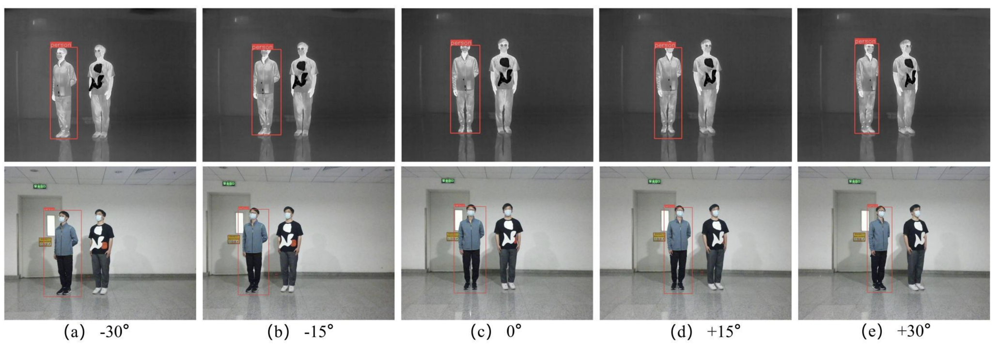

# Unified Adversarial Patch for Cross-modal Attacks in the Physical World

 This is an official implementation 🍎 and we aim to implement an effective rgb-infrared multi-modal attack in the physical world.
 
  🍊\[[Read our arXiv Paper](https://arxiv.org/abs/2307.07859)\]

<div align="center">

 </div>

## 🍇 Usage
<details open>
<summary>Install</summary>
  
[**Python>=3.6.0**](https://www.python.org/) is required with all
[requirements.txt](https://github.com/Aries-iai/Cross-modal_Patch_Attack/requirements.txt) installed including
[**PyTorch>=1.7**](https://pytorch.org/get-started/locally/):
  
<!-- $ sudo apt update && apt install -y libgl1-mesa-glx libsm6 libxext6 libxrender-dev -->


```bash
$ git clone https://github.com/Aries-iai/Cross-modal_Patch_Attack
$ cd Cross-modal_Patch_Attack
$ pip install -r requirements.txt
```

<details open> 
<summary>Data Convention</summary>
The data is organized as follows:

```
dataset  
|-- attack_infrared
    |-- 000.png        # images in the infrared modality
    |-- 001.png
    ...
|-- attack_visible
    |-- 000.png        # images in the visible modality
    |-- 001.png
    ...
```

Here, we should ensure the consistency of infrared images and visible images' names.

<details open> 
<summary>Running</summary>

```shell
python spline_DE_attack.py
```

<details open> 
<summary>Notes</summary>

  1. When you prepare dataset, you need to change directory path in spline_DE_attack.py and DE.py. 
  
  2. ⚠️ If you want to attack other detection models, you need to change yolov3 folder to the model folder you want to attack and add detect_infrared.py, detect_visible.py in this new folder for returning targets' detection confidence scores to DE.

  3. **The weights of yolov3 models can be downloaded from: https://drive.google.com/file/d/1gpPnHcGRjrJAComQety__dWVwJTWCnTk/view?usp=drive_link.**

  4. **The part of attacked images can be downloaded from: https://drive.google.com/file/d/1C7mhrr94lXu4qw_P1dX5hwpRuDc4iI-4/view?usp=drive_link.**


## 🏫 Citation

Cite as below if you find this repository is helpful to your project:

```
@misc{wei2023unified,
      title={Unified Adversarial Patch for Cross-modal Attacks in the Physical World}, 
      author={Xingxing Wei and Yao Huang and Yitong Sun and Jie Yu},
      year={2023},
      eprint={2307.07859},
      archivePrefix={arXiv},
      primaryClass={cs.CV}
}
```
## 🔔 Acknowledgement
Dataset is made from [LLVIP: A Visible-infrared Paired Dataset for Low-light Vision](https://bupt-ai-cz.github.io/LLVIP/). YOLOv3 code is the version of [ultralytics-yolov3](https://github.com/ultralytics/yolov3). Thanks for these great projects.
